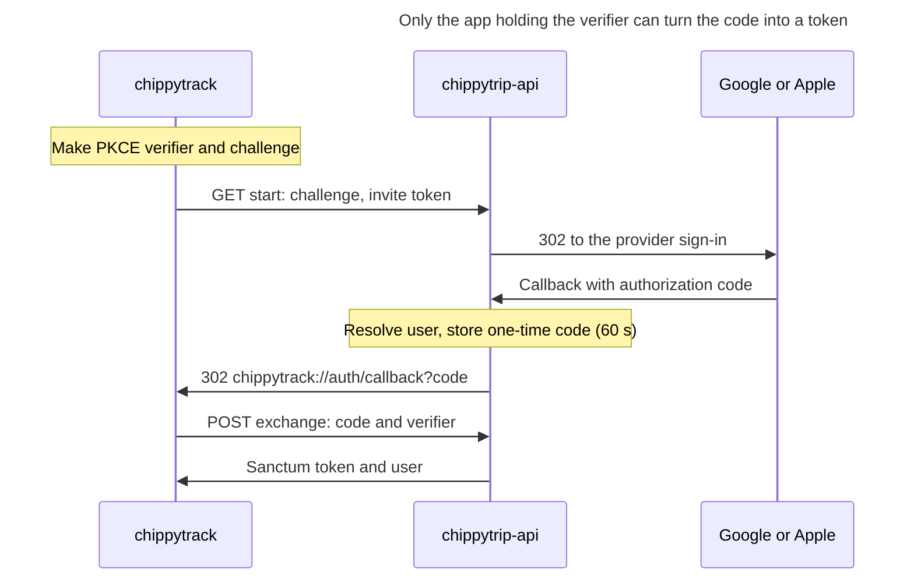

# ChippyTrip authentication & family invitations

Sep 28, 2026 · Robert Miller

> Exported from the design doc at https://claude.ai/code/artifact/a829e8ec-12cc-4451-b2d9-4b89299cb364 (rev 27). The doc is the source of truth; re-export after changing it.

## Overview

ChippyTrip keeps its per-user family lists and adds consent: a family member receives nobody's flights until they accept an invitation. On top of that, users can sign up and sign in with a password, Google or Apple, and an invitee can finish signing up from the invite link with any of the three.

### Goals

- Sign in with a password, a Google account or an Apple account.
- Sign up with any of those three methods.
- Invite family members; the invitee completes signup from the invite.
- A user can be in any number of families.

### What exists today

| Area | chippytrip-api | chippytrack |
| --- | --- | --- |
| Sign-in | `POST /api/sanctum/token` (email, password, `device_name`), returns the token as plain text; rate limited by `throttle:login` | `Auth\Login` calls it, mirrors the user locally, stores the token via `TokenStorage`, enrolls in push |
| Tokens | Sanctum, one per device (unique index on `tokenable_type`, `tokenable_id`, `name`); never expire; no sign-out endpoint | `Logout` forgets the token locally only |
| Sign-up | None; accounts are created on the server | None |
| Family | `family_members`: `user_id` → `family_member_id`, owner-chosen `name`, `auto_add` | `FamilyMembers` screen |
| Adding family | `PUT /api/family-members` creates a placeholder user (null password, `subscription_type = family`) | Sends the whole list |
| Flight sharing | `listeners`; `FlightWatchSvc::addAutoFamilyListeners()`, `WatchListenerController` | `FlightListeners` |
| Deep links | n/a | `NATIVEPHP_DEEPLINK_SCHEME` and `NATIVEPHP_DEEPLINK_HOST` unset |

### Decision: keep per-user family lists, add consent

Each user's family is their own directed list, so belonging to several families already works: Alice can be in Bob's list and in Carol's. Owners keep their own names for people and their own `auto_add` choices, and none of the listener code needs rewriting.

The gap is consent. Today, adding an email that belongs to an existing user starts sending them pushes for your flights without their agreement. This design makes every new family link `pending` until the member accepts, and only accepted members can be put on a flight.

## Data model

All changes are in chippytrip-api. Two columns are added to an existing table, and three tables are new. `users.password` is already nullable.

### Changed: `family_members`

| Column | Type | Notes |
| --- | --- | --- |
| `status` | enum `pending`, `accepted`, `declined`; default `pending` | Backfill every existing row to `accepted` so current listeners keep working |
| `accepted_at` | timestamp, nullable | Set when the member accepts |

### New: `family_invitations`

| Column | Type | Notes |
| --- | --- | --- |
| `id` | bigint |  |
| `family_member_id` | FK → `family_members.id`, cascade delete | One live invitation per family link |
| `token_hash` | char(64), unique | SHA-256 of 32 random bytes; the raw token is only ever in the link |
| `expires_at` | timestamp | 7 days after sending |
| `used_at` | timestamp, nullable | Set on accept or decline; single use |
| timestamps |  |  |

### New: `social_identities`

| Column | Type | Notes |
| --- | --- | --- |
| `id` | bigint |  |
| `user_id` | FK → `users.id`, cascade delete |  |
| `provider` | enum `google`, `apple` |  |
| `provider_user_id` | string | Google `sub` or Apple `sub` |
| `provider_email` | string, nullable | May be an Apple private-relay address |
| timestamps |  | Unique on (`provider`, `provider_user_id`) |

### New: `oauth_exchange_codes`

| Column | Type | Notes |
| --- | --- | --- |
| `code_hash` | char(64), primary | SHA-256 of the one-time code sent to the app |
| `code_challenge` | string | PKCE S256 challenge from `start` |
| `user_id` | FK → `users.id` |  |
| `expires_at` | timestamp | 60 seconds after issue |
| `used_at` | timestamp, nullable | Single use |

### Model changes

- `User::family()` filters to `wherePivot('status', 'accepted')`; add `familyIncludingPending()` for the owner's own list screen, with `status` on the pivot.
- `User::isClaimed()`: true when the user has a password or at least one `social_identities` row. It replaces the rule "null password means never signed up", because social-only users legitimately have no password.
- `User::socialIdentities()` has-many; `FamilyMember::invitation()` has-one.
- Add `social_identity` and `family_invitation` to the morph map only if they ever need to be morph targets; nothing in this design requires it.

## API endpoints

Everything is additive under `/api`; no existing request or response changes shape except that family rows gain `status` and `invite_url`. JSON throughout, except `POST /api/sanctum/token`, which keeps returning plain text so the current app build doesn't break.

### Sign-up, sign-in, sign-out

| Method | Path | Auth | Body → response | Notes |
| --- | --- | --- | --- | --- |
| POST | `/api/auth/register` | — | `name, email, password, device_name, invite_token?` → `{token, user}` | If the email is an unclaimed placeholder, claim it (same id, keeps listeners and family rows). A claimed email returns 422. Throttled like `login`. |
| POST | `/api/sanctum/token` | — | Unchanged; optional `invite_token` | Rejects unclaimed users as today |
| POST | `/api/auth/logout` | token | — → 204 | Deletes the current token and the `user_channels` row whose `identifier` equals the token's `name` (the device id) |
| POST | `/api/auth/logout-all` | token | — → 204 | Deletes all tokens and FCM channels |
| POST | `/api/auth/forgot-password` | — | `email` → 202 | Always 202; uses the existing `password_reset_tokens` table |
| POST | `/api/auth/reset-password` | — | `token, email, password` → 204 | Revokes all existing tokens |

### Google and Apple

| Method | Path | Auth | Body → response | Notes |
| --- | --- | --- | --- | --- |
| GET | `/api/auth/oauth/{provider}/start` | — | query `code_challenge, invite_token?, intent=login\|link, link_ticket?` → 302 to provider | Carries its inputs in an encrypted `state` value; no server session needed |
| GET, POST | `/api/auth/oauth/{provider}/callback` | provider | → 302 to `chippytrack://auth/callback?code=…` or `?error=…` | Apple posts here (`response_mode=form_post`); exclude from CSRF |
| POST | `/api/auth/oauth/exchange` | — | `code, code_verifier, device_name` → `{token, user}` | Checks S256(verifier) = challenge, single use, 60 s |

### Account and identities

| Method | Path | Auth | Body → response | Notes |
| --- | --- | --- | --- | --- |
| GET | `/api/user` | token | Adds `has_password` and `identities: [provider]` | Existing route |
| POST | `/api/me/identities/link-ticket` | token | → `{link_ticket}` | Signed, 2 minutes; passed to `start?intent=link` |
| DELETE | `/api/me/identities/{provider}` | token | → 204 | 409 if it is the last sign-in method |
| PUT | `/api/me/password` | token | `password, current_password?` → 204 | `current_password` required only if one is set |
| DELETE | `/api/me` | token | → 204 | Deletes tokens, channels, listeners and family rows both ways |

### Family and invitations

| Method | Path | Auth | Body → response | Notes |
| --- | --- | --- | --- | --- |
| GET | `/api/family-members` | token | Rows gain `status` and, when pending, `invite_url` | Owner's view of their own list |
| PUT | `/api/family-members` | token | Unchanged request | New rows start `pending` and get an invitation; existing rows keep their status |
| POST | `/api/family-members/{member}/invite` | token | → `{invite_url, expires_at}` | Rotates the token and resends; for the share sheet |
| GET | `/api/invitations/{token}` | — | → `{inviter_name, member_name, email_hint, expires_at}` | 410 when expired or used. `email_hint` is masked (`a•••@work.com`). |
| GET | `/api/family-invitations` | token | → pending invitations addressed to me | Lets a signed-in user see requests without a link |
| POST | `/api/family-invitations/{id}/accept` | token | → 204 | Or accept by token: `POST /api/invitations/{token}/accept` |
| POST | `/api/family-invitations/{id}/decline` | token | → 204 | The owner sees `declined`; they can re-invite later |
| DELETE | `/api/family-memberships/{owner}` | token | → 204 | Leave someone's family: deletes the row and my listeners on their watches |

## Flows

### Password sign-up

1. The app posts `name, email, password, device_name` (plus `invite_token` when it has one) to `/api/auth/register`.
2. The API claims the matching unclaimed placeholder or creates a new user, accepts the invitation if a token came with it, and issues a Sanctum token named after the device.
3. The app runs the same post-sign-in step as login today: mirror the user, store the token, sign in locally, enroll in push.
4. A verification email goes out. Nothing is blocked on it, but password reset and invitations by email match only verified addresses.

### Google and Apple sign-in

The browser only ever carries a one-time code that expires in 60 seconds. The token is released only to a caller that presents the PKCE verifier, which never leaves the app. Both providers use the same path; NativePHP's `Browser::auth()` opens the auth session and catches the deep-link return (check its v3 signature before building on it).

### Who the callback signs in

The callback checks these in order and stops at the first match:

1. A `social_identities` row matches (`provider`, `sub`): sign in as that user.
2. `intent=link` with a valid `link_ticket`: attach the identity to that user.
3. An `invite_token` whose invited user is unclaimed: claim that placeholder. Attach the identity, take the name and email from the provider, and accept the family link. This is what makes Apple private-relay addresses work: the token identifies the invitee, not the email.
4. An `invite_token` whose invited user is already claimed by someone else: resolve the caller by rules 5 and 6, then merge the placeholder into them if it is still unclaimed, and accept.
5. The provider email is verified (Google `email_verified`, any Apple email) and matches a user: claim it if unclaimed, otherwise link the identity to it.
6. Otherwise create a new user.

### Invitation

1. Bob adds Alice through `PUT /api/family-members`. The row is `pending`. If Alice's email has no account, a placeholder is created as today.
2. The API creates an invitation and returns `invite_url` (`https://chippytrip.com/invite/{token}`). Postmark emails it; Bob can also share it from the app.
3. Alice has an account: she also gets a push and sees the request under `GET /api/family-invitations`. Accepting needs no link.
4. Alice has no account: the link opens the app (Android App Link) or the web page with a Play Store link. The app keeps the token through the install and shows "Bob invited you to see his flights."
5. Alice signs up by any method, and the token rides along. The API claims or merges, sets the row to `accepted`, and marks the invitation used, in one transaction.
6. Bob's `FamilyMembers` screen shows Alice as accepted; she is now available for `auto_add` and the listener picker.

### Merging a placeholder into a real account

Bob invited `alice@work.com`, but Alice signs up with her personal Google account. The invite token proves she is the intended person, so `App\Actions\MergeUsers` runs in one transaction:

- Move `listeners.user_id` to the real account, skipping any watch she is already on.
- Move `family_members` rows on both sides (`user_id` and `family_member_id`), skipping duplicates.
- Move `user_channels`.
- Delete the placeholder.

Only unclaimed placeholders are ever merged away; two claimed accounts are never merged automatically.

## Authorization rules

Only accepted family members can be put on a flight, and only claimed users can sign in.

| Rule | Where it is enforced |
| --- | --- |
| `auto_add` adds only accepted members | `FlightWatchSvc::addAutoFamilyListeners()` via the filtered `User::family()` |
| The listener picker offers and accepts only accepted members; a pending email fails validation with 422 | `WatchListenerController::update()` (its `$family` comes from the filtered relation) |
| Existing listener rows are never removed by this change | The migration backfills existing `family_members` rows to `accepted` |
| A decline or leave removes the member's listeners on the owner's watches | `FamilyInvitationController::decline()`, `FamilyMembershipController::destroy()` |
| Unclaimed users cannot get a token | `Authorizer::genToken()` and the OAuth callback check `isClaimed()` rather than a null password |
| Only the owner can see or resend their invitations | Route model binding scoped to `$request->user()->familyMembers()` |
| Invitation tokens are single use, expire after 7 days, and are stored hashed | `family_invitations.token_hash`, `expires_at`, `used_at` |
| Invitation lookups and OAuth exchanges are rate limited | New `throttle:invites` and `throttle:oauth` limiters beside the existing `login` limiter in `AppServiceProvider` |
| Unlinking the last sign-in method is refused | `DELETE /api/me/identities/{provider}` returns 409 |

`GET /api/invitations/{token}` is public, so it reveals only the inviter's name, the name they gave the member and a masked email.

## App changes (chippytrack)

Every sign-in method ends in one shared action, and invite links work whether or not the person is signed in.

### Screens

| Screen | Change |
| --- | --- |
| `Auth\Login` | Add Continue with Google, Continue with Apple, Create account and Forgot password |
| `Auth\Register` (new) | Name, email, password; picks up a stored invite token |
| `Auth\ForgotPassword` (new) | Email field; posts to `/api/auth/forgot-password` |
| Invite landing (new, guest route `invite/{token}`) | Shows "Bob invited you to see his flights" from the preview endpoint. Signed out: the three sign-up options. Signed in: Accept and Decline. |
| `FamilyMembers` | A Pending, Accepted or Declined badge per row; a Share invite button on pending rows opens the share sheet with `invite_url` |
| Dashboard or `UserMenu` | A card listing incoming requests from `/api/family-invitations`, with Accept and Decline |
| `Settings\Profile` | Linked sign-in methods with link and unlink; set or change password; sign out everywhere |
| `Settings\DeleteUserForm` | Calls `DELETE /api/me`, then signs out locally |

### Plumbing

- `App\Actions\CompleteSignIn`: pull today's post-login block out of `Auth\Login` (mirror the `User`, store the token in `TokenStorage`, `Auth::login`, `session()->regenerate()`, `PushNotifications::enroll()`) so password, Google, Apple and register all share it.
- `ChippyTripApi`: add `register()`, `logout()`, `oauthExchange()`, `invitationPreview()`, `acceptInvitation()`, `declineInvitation()`, `myInvitations()`, `resendInvite()`, `identities()`, `unlinkIdentity()`, `setPassword()`, `deleteAccount()`.
- 401 handling in one place in `ChippyTripApi`: remove the token, log out locally, redirect to `login`.
- OAuth: generate the verifier (43+ random URL-safe characters) and store it in `TokenStorage` as `oauth_verifier`, open `start` with `Browser::auth()`, then handle `chippytrack://auth/callback` in a route that exchanges the code and calls `CompleteSignIn`.
- Invite tokens: the landing route stores the token as `pending_invite` in `TokenStorage` so it survives a Play Store install and a trip through sign-up; `CompleteSignIn` clears it once accepted.
- `Logout`: call `/api/auth/logout` before clearing the token, so the server drops this device's FCM channel.
- After sign-in, the existing `UpdateFcmToken` listener re-registers the device as it does today.

## Provider setup

Google and Apple both redirect to the API, not the app, so each needs only a web client and one HTTPS callback URL.

### Packages (chippytrip-api)

- `composer require laravel/socialite socialiteproviders/apple`
- Register the Apple provider in `AppServiceProvider::boot()` with `Event::listen(SocialiteWasCalled::class, AppleExtendSocialite::class.'@handle')`.
- Use `->stateless()` on both drivers; `state` carries the encrypted start inputs instead of a session.

### Google

- In Google Cloud Console, under the Firebase project `chippytrip-f1ca3` or a new one, create an OAuth client of type **Web application**.
- Authorized redirect URI: `https://api-dev.chippytrip.com/api/auth/oauth/google/callback`.
- Scopes: `openid email profile`.
- `.env`: `GOOGLE_CLIENT_ID`, `GOOGLE_CLIENT_SECRET`, `GOOGLE_REDIRECT_URI`.
- OAuth consent screen: publish it before the beta, or every beta tester must also be listed as a test user.

### Apple

- In the Apple Developer account, create an App ID with Sign in with Apple enabled, then a **Services ID** (this is the `client_id`).
- Configure the Services ID: domain `api-dev.chippytrip.com`, return URL `https://api-dev.chippytrip.com/api/auth/oauth/apple/callback`.
- Create a Sign in with Apple key and download the `.p8`; note the Key ID and Team ID.
- `.env`: `APPLE_CLIENT_ID`, `APPLE_TEAM_ID`, `APPLE_KEY_ID`, `APPLE_PRIVATE_KEY` (path to the `.p8`), `APPLE_REDIRECT_URI`. The package signs the client-secret JWT from these.
- Apple sends the user's name and email only on the first authorization, as a POST field. Save them immediately in the callback.
- Users can hide their email behind `@privaterelay.appleid.com`. Register Postmark's sending domain under Apple's Private Email Relay settings so invitation and reset emails reach them.
- Exclude `api/auth/oauth/*/callback` from CSRF verification.

### Deep links

- chippytrack `.env`: `NATIVEPHP_DEEPLINK_SCHEME=chippytrack` for the OAuth return, `NATIVEPHP_DEEPLINK_HOST=chippytrip.com` for invite App Links.
- Serve `https://chippytrip.com/.well-known/assetlinks.json` for `com.chippytrip.chippytrack` with the release and debug signing-key SHA-256 fingerprints, plus the Play app signing key once builds ship through Play.
- `https://chippytrip.com/invite/{token}` also needs a plain web page for people without the app: install instructions (App Tester during the beta, a Play Store link after launch) plus the token to paste after installing.

### Postmark

- New outbound templates: family invitation, password reset and email verification. Invitation links go to `https://chippytrip.com/invite/{token}`.

## Beta program

Beta testers are invited with an artisan command and install the app through Firebase App Distribution. It runs on the existing Firebase project `chippytrip-f1ca3` and has an API the command can call; Google Play testing tracks come later, closer to launch.

### Distribution channels

| Channel | Testers | Tester management | Install experience | When |
| --- | --- | --- | --- | --- |
| Firebase App Distribution | 500 per project, 200 per group | REST API: `groups:batchJoin` with `createMissingTesters` | Email invite, then the App Tester app | Now |
| Play internal testing | 100 | Email list in Play Console; the API only takes Google Groups | Play Store opt-in link, no review | Pre-launch |
| Play closed testing | Email lists or Google Groups | Same as internal | Play Store opt-in link, with review | Pre-launch; may be required before production |

Personal Play developer accounts created after November 13, 2023 need a closed test with at least 12 testers opted in for 14 continuous days before production access. Organization accounts are exempt.

### Data model: `beta_testers`

| Column | Type | Notes |
| --- | --- | --- |
| `id` | bigint |  |
| `email` | string, unique | Lowercased |
| `name` | string, nullable | For the invite email |
| `source` | enum: direct, family | direct = beta:invite; family = added when a family invitation is sent |
| `invited_by` | fk users, nullable | The family owner, for family rows |
| `firebase_tester` | string, nullable | Tester resource name returned by the API |
| `invited_at` | timestamp | Set on each successful invite |
| `user_id` | fk users, nullable | Linked when an account with that email signs up or signs in |
| `removed_at` | timestamp, nullable | Set by `beta:remove` |

### Artisan commands

- `php artisan beta:invite {email} {--name=} {--resend}`: upsert the `beta_testers` row, call `groups/beta:batchJoin` with `createMissingTesters: true`, then send a Postmark welcome email that explains the App Tester install and sign-up.
- `php artisan beta:remove {email}`: call `testers:batchRemove`, which revokes access to all releases, and set `removed_at`.
- `php artisan beta:list`: table of testers, invite date and whether they have an account.
- Service class `App\Services\AppDistribution` wraps the API with `google/auth` service-account credentials and the `cloud-platform` scope; the commands stay thin.
- Config in `config/services.php` under `firebase`: `project_number`, `android_app_id`, `app_distribution_key` (path to the service-account JSON on `madsci`), `beta_group` (default `beta`).

### Sign-up gate

During the beta, only emails in `beta_testers` (with `removed_at` null) can create an account. Existing accounts keep signing in.

- Config flag `chippytrip.beta_gate` (env `BETA_GATE=true`); turning it off opens sign-up at launch.
- Checked in one place, `App\Actions\EnsureBetaAccess`, called by `POST /api/auth/register` and by the OAuth callback before it creates a new user.
- Rejection: `403` with `{"error": "beta_closed"}`; the app shows a "ChippyTrip is in private beta" screen instead of the form error.
- On success, set `beta_testers.user_id`.
- `beta:remove` blocks new sign-ups for that email but does not delete an existing account.

Family invitees can always sign up. While `BETA_GATE` is on, sending a family invitation also adds the invitee to the Firebase `beta` group and creates a `beta_testers` row with `source = family`, so they can install the app. `EnsureBetaAccess` also passes any sign-up that carries a valid, unexpired family invitation token, which covers an invitee who signs up with a different email than the one invited.

### Firebase setup

1. Firebase console, App Distribution, Get started for `com.chippytrip.chippytrack`.
2. Create the tester group with alias `beta`.
3. Enable `firebaseappdistribution.googleapis.com` in the GCP project.
4. Create a service account with the Firebase App Distribution Admin role; store its JSON key on `madsci` outside the repo.

### Shipping a build

1. Bump `versionCode` and `versionName`, build a release APK signed with the release key.
2. `firebase appdistribution:distribute app-release.apk --app <ANDROID_APP_ID> --groups beta --release-notes "..."`.
3. Testers in the group get the update in App Tester. Anyone added later sees every release already shared with the group.

### Signing and sign-in gotchas

- Google sign-in uses the browser flow with the Web application OAuth client, so it needs no Android SHA-1. Signing fingerprints matter for App Links instead.
- App Distribution installs the build signed with the release key; Play re-signs with the Play app signing key. `assetlinks.json` must list both SHA-256 fingerprints once Play is in use, or invite links stop opening the app from one channel.
- If the OAuth consent screen is in Testing status, only listed test users can sign in with Google. Publish it (the `openid email profile` scopes need no verification) or add each beta tester there too.
- Developer verification: from September 30, 2026, unregistered apps stop installing on certified devices in Brazil, Indonesia, Singapore and Thailand, with global rollout in 2027. A US beta is unaffected for now; register `com.chippytrip.chippytrack` under a verified developer account before 2027.

## Build order

Each step ships on its own, and step 1 changes nothing the current app build can see.

- [ ] **Consent gating.** Migration adding `status` and `accepted_at` with the backfill; filtered `User::family()` plus `familyIncludingPending()`; `User::isClaimed()`; `status` in `FamilyMemberResource`. Feature tests: pending members are skipped by auto-add and rejected by `PUT /api/watches/{id}/listeners`.
- [ ] **Password sign-up and sign-out.** `register`, `logout`, `logout-all`, forgot and reset password. In the app: `CompleteSignIn`, `Auth\Register`, `Auth\ForgotPassword`, server logout.
- [ ] **Invitations.** `family_invitations`, the invite, preview, accept and decline endpoints, Postmark template, deep-link scheme and host, `assetlinks.json`, the invite landing route, badges and share button in `FamilyMembers`.
- [ ] **Beta program.** `beta_testers`, `App\Services\AppDistribution`, `beta:invite`, `beta:remove`, `beta:list`, the sign-up gate, the Postmark welcome template, Firebase group `beta`, first release uploaded. Reuses the invitations Postmark setup and landing page.
- [ ] **Google.** Socialite, `oauth_exchange_codes`, start, callback and exchange, `social_identities`, the resolution rules and `MergeUsers`. In the app: PKCE and `Browser::auth()`.
- [ ] **Apple.** Services ID and key, the `form_post` callback, first-authorization name and email, relay domain in Postmark.
- [ ] **Account management.** Identity linking and unlinking, set password, `DELETE /api/me` wired to `DeleteUserForm`.

## Before public launch

The beta stays closed until these are done; none of them block the build order above.

- [ ] **Google Play developer account.** One-time $25 fee plus identity verification. Registering as an individual (personal account); this also covers Android developer verification for `com.chippytrip.chippytrack`.
- [ ] **Apple Developer Program.** $99 per year; needed for the Apple Services ID and key in the Apple build step, TestFlight and the App Store. Enrolling as an individual.
- [ ] **Subscriptions and billing.** Design still to come: plans and what `subscription_type` means for each, how family members are covered, and store billing (Google Play Billing, Apple in-app purchase) with server-side receipt verification.
- [ ] **Store listings.** Privacy policy URL, Play data safety form, App Store privacy labels, and a web account-deletion page backed by `DELETE /api/me`.
- [ ] **Play closed test**, required for a new personal account: 12 testers opted in for 14 continuous days before production access; the beta group can be moved over.
- [ ] **Open sign-up.** Set `BETA_GATE=false`.

## Open questions

- Should pending members keep receiving pushes for flights they were already added to before this ships? The backfill says yes for existing rows; new rows wait for acceptance.
- Does a sign-up without an invite get `subscription_type = free`, and does claiming a `family` placeholder keep `family` or change it?
- Should an owner be able to see that an invitee declined, or should a decline look the same as an expired invitation?
- Is `chippytrip.com` the right host for invite links, or should they use `api-dev.chippytrip.com` until a production host exists?

## Sources

- [Firebase App Distribution API reference](https://firebase.google.com/docs/reference/app-distribution/rest)
- [groups.batchJoin](https://firebase.google.com/docs/reference/app-distribution/rest/v1/projects.groups/batchJoin)
- [testers.batchAdd](https://firebase.google.com/docs/reference/app-distribution/rest/v1/projects.testers/batchAdd)
- [App Distribution tester limits](https://docs.bigfishgames.com/docs/developer/firebase-distribution)
- [App testing requirements for new personal developer accounts](https://support.google.com/googleplay/android-developer/answer/14151465?hl=en)
- [Android developer verification enforcement timeline](https://www.helpnetsecurity.com/2026/06/19/android-developer-verification-rollout-markets/)
