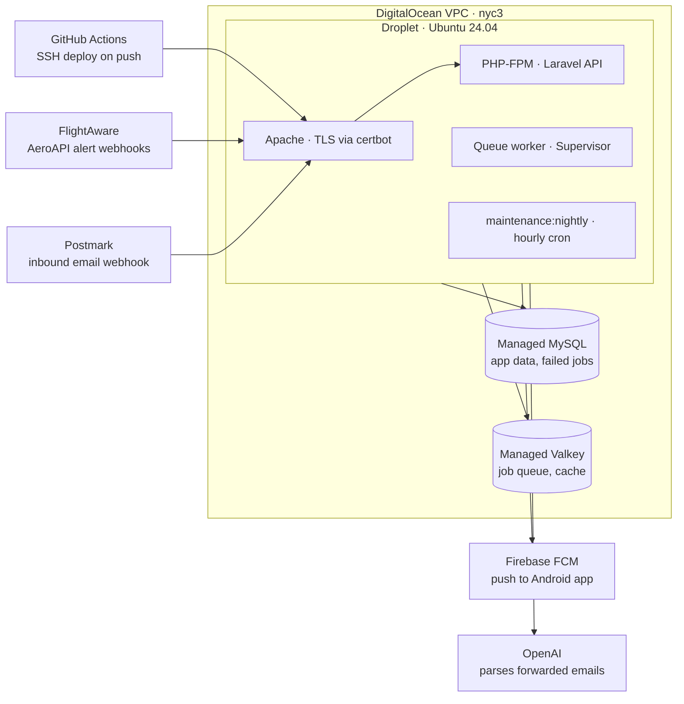

# Chippytrip API — DigitalOcean Deployment Runbook

_Last updated 2026-09-30._

## Overview

One Ubuntu 24.04 droplet runs Apache, PHP-FPM, the queue worker, and the hourly `maintenance:nightly` cron. Over DigitalOcean's private VPC it uses two managed databases. MySQL holds app data and failed jobs. Valkey holds the job queue and the cache. Every push to `master` runs the Safe test suite on GitHub Actions, then SSHes in and deploys.

Replace these placeholders throughout:

| Placeholder | Meaning |
| --- | --- |
| `nyc3` | Region (closest to Rochester). Droplet and both databases must share it. |
| `DROPLET_IP` | Droplet's public IPv4 |
| `api.chippytrip.com` | Production hostname: the one madsci serves today (see step 10) |
| `api-do.chippytrip.com` | Temporary hostname for testing before cutover |
| `/var/www/chippytrip-api` | App directory |
| `rmiller335/chippytrip-api` | GitHub repo |
| `<mysql-id>`, `<valkey-id>`, `<droplet-id>` | IDs from `doctl ... list` |
| `8.3` | PHP version. Match what `php -v` shows on `madsci`. |

Commands prefixed with `$` run on your own machine. Everything else runs on the droplet unless noted.



Only ports 22, 80 and 443 face the internet. MySQL and Valkey accept connections from the droplet alone, over the VPC.

## 0. App changes for Valkey

These are already on `master`. This machine runs the queue on a local Valkey, so the code has been exercised against a real worker.

- **Queue driver.** `QUEUE_CONNECTION=redis`. Laravel's `redis` driver talks to Valkey unchanged through `phpredis`, and `composer.json` requires `ext-redis`.
- **Jobs wait for the transaction to commit.** `MaintenanceNightly::handle()` dispatches `EnableWatch` and `DisableWatch` inside `DB::transaction()`. The database queue hid those jobs until commit. Valkey receives them at once, so the `redis` connection sets `after_commit => true` in `config/queue.php`.
- **The health check can fail on Valkey.** `HealthCheckSvc::queue()` asks the queue connection for the creation time of its oldest pending job (`creationTimeOfOldestPendingJob()`, which both the database and redis drivers implement) and fails once that is older than `HEALTH_QUEUE_MAX_WAIT`. Its heartbeat job means a stopped worker always leaves something waiting.
- **`db:clear`** clears the queue through the driver instead of truncating `jobs`.

Run the Safe suite against MySQL (`phpunit-safe.xml` uses SQLite, where SmokeTest fails):

```bash
$ vendor/bin/phpunit -c phpunit.xml tests/Safe
```

## 1. Create the droplet, databases and firewall

All three resources go in the same region so they land on that region's default VPC and can talk over private addresses. Everything here runs on your machine with `doctl`. The control panel works just as well if you prefer.

```bash
$ doctl auth init
$ doctl compute ssh-key import rmiller --public-key-file ~/.ssh/id_ed25519.pub
$ doctl compute ssh-key list          # note the fingerprint

$ doctl compute droplet create chippytrip-api \
    --region nyc3 --size s-1vcpu-2gb --image ubuntu-24-04-x64 \
    --ssh-keys <fingerprint> --enable-monitoring --enable-backups --wait

$ doctl databases create chippytrip-mysql --engine mysql --version 8 \
    --region nyc3 --size db-s-1vcpu-1gb --num-nodes 1

$ doctl databases create chippytrip-valkey --engine valkey --version 8 \
    --region nyc3 --size db-s-1vcpu-1gb --num-nodes 1

$ doctl compute droplet list          # droplet ID + public IP
$ doctl databases list                # database IDs
```

The databases take several minutes to provision.

Next, allow only the droplet to reach each database (trusted sources):

```bash
$ doctl databases firewalls append <mysql-id>  --rule droplet:<droplet-id>
$ doctl databases firewalls append <valkey-id> --rule droplet:<droplet-id>
```

Finally, add a cloud firewall allowing only SSH, HTTP and HTTPS in:

```bash
$ doctl compute firewall create --name chippytrip-fw \
    --inbound-rules "protocol:tcp,ports:22,address:0.0.0.0/0,address:::/0 protocol:tcp,ports:80,address:0.0.0.0/0,address:::/0 protocol:tcp,ports:443,address:0.0.0.0/0,address:::/0" \
    --outbound-rules "protocol:tcp,ports:all,address:0.0.0.0/0,address:::/0 protocol:udp,ports:all,address:0.0.0.0/0,address:::/0 protocol:icmp,address:0.0.0.0/0,address:::/0" \
    --droplet-ids <droplet-id>
```

Port 22 stays open to the world because GitHub's runner IPs change constantly. Key-only SSH (step 2) is what protects it.

Last, point `api-do.chippytrip.com` at `DROPLET_IP` with an A record now, so TLS can be issued in step 7.

## 2. Harden the droplet

Log in as root once, create your own sudo user, and turn off root and password logins.

```bash
$ ssh root@DROPLET_IP

apt update && apt -y full-upgrade
timedatectl set-timezone America/New_York

adduser --gecos "" rmiller
usermod -aG sudo rmiller
rsync --archive --chown=rmiller:rmiller ~/.ssh /home/rmiller
```

Edit `/etc/ssh/sshd_config` (or drop a file in `/etc/ssh/sshd_config.d/`):

```
PermitRootLogin no
PasswordAuthentication no
KbdInteractiveAuthentication no
```

```bash
sshd -t && systemctl restart ssh
```

From a **second terminal**, confirm `ssh rmiller@DROPLET_IP` and `sudo -v` work before you close the root session.

Security updates install automatically on Ubuntu (`unattended-upgrades` is on by default). Check with:

```bash
systemctl status unattended-upgrades
```

The 2 GB droplet has no swap, and `composer install` can spike memory. Add 2 GB of swap:

```bash
sudo fallocate -l 2G /swapfile && sudo chmod 600 /swapfile
sudo mkswap /swapfile && sudo swapon /swapfile
echo '/swapfile none swap sw 0 0' | sudo tee -a /etc/fstab
```

## 3. Install the stack

Ubuntu 24.04 ships PHP 8.3, so no PPA is needed. If `madsci` runs a different version, install it from `ppa:ondrej/php` instead and adjust `8.3` everywhere below.

```bash
sudo apt install -y apache2 git unzip supervisor mysql-client \
  php8.3-fpm php8.3-cli php8.3-mysql php8.3-mbstring php8.3-xml \
  php8.3-curl php8.3-zip php8.3-bcmath php8.3-intl php8.3-gd \
  php8.3-mailparse php8.3-redis

# Apache talks to PHP-FPM; don't install libapache2-mod-php
sudo a2enmod proxy_fcgi setenvif

# Composer
curl -sS https://getcomposer.org/installer | php
sudo mv composer.phar /usr/local/bin/composer

# certbot (same snap-based setup as madsci)
sudo snap install --classic certbot
sudo ln -s /snap/bin/certbot /usr/bin/certbot
```

Two of these packages exist because of specific code in the repo. `php8.3-mailparse` is needed by `MailparseEmailBodyExtractor`, which parses forwarded confirmation emails. `php8.3-gd` is needed by `phpoffice/phpspreadsheet`.

Compare extensions against `madsci` so nothing is missing:

```bash
# on madsci and on the droplet, then diff the two lists
php -m | sort > /tmp/php-mods.txt
```

Node isn't needed. The Vite and Tailwind files in the repo are unused leftovers from the Laravel skeleton; the app is API-only and has no front-end build.

## 4. Configure managed MySQL

Give the app its own database and user instead of `doadmin`.

```bash
$ doctl databases db create <mysql-id> chippytrip
$ doctl databases user create <mysql-id> chippytrip   # prints the password
```

In the control panel, open the cluster's **Connection details**, switch to **VPC network**, and note the `private-…` hostname. The port is `25060`. Then click **Download CA certificate** and copy it to the droplet:

```bash
$ scp ca-certificate.crt rmiller@DROPLET_IP:/tmp/
sudo mv /tmp/ca-certificate.crt /etc/ssl/certs/do-mysql-ca.crt
sudo chmod 644 /etc/ssl/certs/do-mysql-ca.crt
```

Test from the droplet:

```bash
mysql -h private-chippytrip-mysql-do-user-XXXX-0.X.db.ondigitalocean.com \
  -P 25060 -u chippytrip -p --ssl-mode=VERIFY_CA \
  --ssl-ca=/etc/ssl/certs/do-mysql-ca.crt chippytrip
```

**Primary keys.** DO enables `sql_require_primary_key` by default. Every table created in `database/migrations` already has a primary key, so leave the setting on.

The existing data is copied over in step 10.

Two things in the repo assume your dev machine can reach the production database: `bin/sync-test-db`, which dumps from `DB_*` in your local `.env`, and the `production_ro` connection (`PROD_DB_*`). To keep using them after the move, add your home IP as a trusted source:

```bash
$ doctl databases firewalls append <mysql-id> --rule ip_addr:<home-ip>
```

Use the public hostname from your dev machine. `production_ro` has no SSL CA option in `config/database.php`, so add an `options` entry like the `mysql` connection's before pointing it at DO.

## 5. Configure Valkey

Valkey holds the job queue and the cache. Failed jobs stay in MySQL's `failed_jobs` table. `config/database.php` already reads `REDIS_USERNAME` and keeps the queue (db 0) and cache (db 1) apart.

From the cluster's **Connection details → VPC network**, note:

- the `private-…` hostname
- the port, `25061`
- the user, `default`
- the password

TLS is mandatory.

**Eviction policy.** Set `volatile-lru`, never an `allkeys-*` policy. Under `volatile-lru`, only keys with a TTL are evicted. Queued jobs, `maintenance:nightly`'s last-run key, and the heartbeat pending key all have no TTL, so they are never dropped, while ordinary cache entries still make room. If memory does fill with no-TTL keys, writes fail loudly instead of jobs silently disappearing.

```bash
$ doctl databases eviction-policy set <valkey-id> volatile_lru
```

The 1 GB plan is plenty. Jobs are small and are removed as soon as they complete.

You'll test the connection after writing `.env` in step 6.

## 6. Deploy user, first checkout and .env

A dedicated `deploy` user owns the code and runs PHP-FPM, the queue worker and cron. That way every file is written by one user and there are no permission fights over `storage/`.

```bash
sudo adduser --disabled-password --gecos "" deploy
sudo mkdir -p /var/www/chippytrip-api
sudo chown deploy:deploy /var/www/chippytrip-api
```

Run the PHP-FPM pool as `deploy`. In `/etc/php/8.3/fpm/pool.d/www.conf`, set:

```
user = deploy
group = deploy
listen.owner = www-data
listen.group = www-data
```

```bash
sudo systemctl restart php8.3-fpm
```

Next, give the droplet read-only access to the repo:

```bash
sudo -iu deploy
ssh-keygen -t ed25519 -f ~/.ssh/github_deploy -N "" -C "chippytrip-droplet"
cat ~/.ssh/github_deploy.pub
```

Add that public key under GitHub repo **Settings → Deploy keys** (leave write access off). Then, still as `deploy`:

```bash
cat >> ~/.ssh/config <<'EOF'
Host github.com
  IdentityFile ~/.ssh/github_deploy
  IdentitiesOnly yes
EOF
chmod 600 ~/.ssh/config

ssh -T git@github.com        # answer yes to the host key
git clone git@github.com:rmiller335/chippytrip-api.git /var/www/chippytrip-api
cd /var/www/chippytrip-api
composer install --no-dev --optimize-autoloader --no-interaction
cp .env.example .env
```

Edit `.env`:

```
APP_ENV=production
APP_DEBUG=false
APP_URL=https://<production hostname>
APP_KEY=            # copy from madsci's .env, don't generate a new one

LOG_STACK=daily

DB_CONNECTION=mysql
DB_HOST=private-chippytrip-mysql-do-user-XXXX-0.X.db.ondigitalocean.com
DB_PORT=25060
DB_DATABASE=chippytrip
DB_USERNAME=chippytrip
DB_PASSWORD=...
MYSQL_ATTR_SSL_CA=/etc/ssl/certs/do-mysql-ca.crt

QUEUE_CONNECTION=redis
CACHE_STORE=redis
REDIS_CLIENT=phpredis
REDIS_HOST=tls://private-chippytrip-valkey-do-user-XXXX-0.X.db.ondigitalocean.com
REDIS_PORT=25061
REDIS_USERNAME=default
REDIS_PASSWORD=...

MAIL_MAILER=postmark
```

Copy the remaining values from `madsci`'s `.env`. These are what the code reads:

| Group | Keys |
| --- | --- |
| FlightAware | `FLIGHTAWARE_URL`, `FLIGHTAWARE_KEY`, `FLIGHTAWARE_CALLBACK` |
| Flight data | `AIRLABS_*`, `AVIATIONEDGE_*`, `FLIGHTSERVICE_*`, `TIMEZONE_*`, `SYNC_PAST_DAYS` |
| Email parsing | `OPENAI_API_KEY`, `OPENAI_FLIGHT_MODEL` |
| Push | `FCM_PROJECT_ID`, `FIREBASE_CREDENTIALS` |
| Postmark | `POSTMARK_API_KEY`, `POSTMARK_INBOUND_USER`, `POSTMARK_INBOUND_PASSWORD`, `POSTMARK_INBOUND_URL`, `MAIL_FROM_*` |
| Health and auth | `HEALTH_TOKEN`, `HEALTH_*`, `LOGIN_RATE_LIMIT*` |

`OPENAI_*`, `FCM_PROJECT_ID` and `FIREBASE_CREDENTIALS` aren't in `.env.example`, so they're easy to miss.

The Firebase service-account JSON lives in `storage/app/firebase/`, which is gitignored. Copy that directory from `madsci`, then set `FIREBASE_CREDENTIALS` to its absolute path on the droplet:

```bash
# on madsci
scp -r storage/app/firebase rmiller@DROPLET_IP:/tmp/
# on the droplet
sudo mv /tmp/firebase /var/www/chippytrip-api/storage/app/
sudo chown -R deploy:deploy /var/www/chippytrip-api/storage/app/firebase
sudo chmod 700 /var/www/chippytrip-api/storage/app/firebase
```

Reusing `madsci`'s `APP_KEY` matters: anything stored with `encrypted` casts or `Crypt` is unreadable under a new key.

Finally, lock down `.env` and check both connections:

```bash
chmod 600 .env
php artisan about
php artisan migrate:status        # proves the MySQL connection
php artisan tinker --execute="cache()->put('t', 1, 60); dump(cache()->get('t'));"
exit    # back to rmiller
```

## 7. Apache and TLS

Serve the test hostname first. The production name gets added at cutover.

Create `/etc/apache2/sites-available/chippytrip-api.conf`. The repo gitignores `public/.htaccess`, so a fresh clone has none, and the vhost carries the rules itself.

Two lines do the work of the missing file. `FallbackResource` routes every request to `index.php`. `SetEnvIf Authorization` passes the header through to PHP-FPM, which needs it for both Sanctum bearer tokens and the Postmark inbound basic auth. Without that line, every authenticated request returns 401.

```apache
<VirtualHost *:80>
    ServerName api-do.chippytrip.com
    DocumentRoot /var/www/chippytrip-api/public

    <Directory /var/www/chippytrip-api/public>
        Options -Indexes +FollowSymLinks
        AllowOverride None
        Require all granted
        FallbackResource /index.php
    </Directory>

    # Sanctum bearer tokens and Postmark basic auth
    SetEnvIf Authorization "(.*)" HTTP_AUTHORIZATION=$1

    <FilesMatch \.php$>
        SetHandler "proxy:unix:/run/php/php8.3-fpm.sock|fcgi://localhost"
    </FilesMatch>

    ErrorLog ${APACHE_LOG_DIR}/chippytrip-api-error.log
    CustomLog ${APACHE_LOG_DIR}/chippytrip-api-access.log combined
</VirtualHost>
```

Enable the site and issue a certificate:

```bash
sudo a2dissite 000-default
sudo a2ensite chippytrip-api
sudo apache2ctl configtest && sudo systemctl reload apache2

sudo certbot --apache -d api-do.chippytrip.com
sudo certbot renew --dry-run
```

Certbot writes a `chippytrip-api-le-ssl.conf` vhost for 443 and adds the HTTP→HTTPS redirect. The snap installs its own renewal timer. Apache's default request-body limit is well above Postmark's inbound size, so there's no body-size setting to raise.

## 8. Queue worker and hourly maintenance

The app queues `SendNotification`, `NotificationsIndex`, `ParseConfirmationEmail`, `AddFlightDetails`, `EnableWatch`, `DisableWatch` and `HealthHeartbeat` on the default queue, now in Valkey. On `madsci` these run through `bin/dev-queue-worker` (`queue:listen`). In production, run `queue:work` under Supervisor instead.

Create `/etc/supervisor/conf.d/chippytrip-worker.conf`:

```ini
[program:chippytrip-worker]
process_name=%(program_name)s_%(process_num)02d
command=php /var/www/chippytrip-api/artisan queue:work --sleep=3 --tries=3 --max-time=3600
user=deploy
numprocs=2
autostart=true
autorestart=true
stopasgroup=true
killasgroup=true
redirect_stderr=true
stdout_logfile=/var/www/chippytrip-api/storage/logs/worker.log
stopwaitsecs=120
```

Then load it:

```bash
sudo supervisorctl reread
sudo supervisorctl update
sudo supervisorctl status
```

With the step 0 change, the `/health` queue check fails if a heartbeat job waits longer than `HEALTH_QUEUE_MAX_WAIT` (300 s), so a stopped worker shows up there. `queue:restart` stores its restart signal in the cache, so it works the same on Valkey.

**Cron.** `routes/console.php` has no schedule. `maintenance:nightly` runs straight from cron **hourly**, despite its name. It enables and disables watches, prunes unwatched flights, and deletes FlightAware alerts that have no matching watch. `/health` fails if it hasn't finished within `HEALTH_MAINTENANCE_MAX_AGE` (7200 s).

Add it to the `deploy` user's crontab (`sudo crontab -u deploy -e`):

```
# enable at cutover (step 10)
# 17 * * * * cd /var/www/chippytrip-api && php artisan maintenance:nightly >> storage/logs/maintenance.log 2>&1
```

The repo doesn't record the rest of the cron setup. Run `crontab -l` on `madsci` and copy any other entries you rely on (e.g. `airlines:update`, `airports:update`, `notifications:audit`, `watch:cleanup`). Leave them **commented out** until cutover (step 10), so the two servers never run maintenance at the same time.

## 9. GitHub Actions deploy

GitHub's runner SSHes in as `deploy` and runs the deploy script. First, create a key pair for it on your own machine and install the public half on the droplet:

```bash
$ ssh-keygen -t ed25519 -f gh_actions_deploy -N "" -C "github-actions"
$ ssh-keyscan -H DROPLET_IP > known_hosts.txt

$ scp gh_actions_deploy.pub rmiller@DROPLET_IP:/tmp/
# on the droplet:
sudo mkdir -p /home/deploy/.ssh
sudo sh -c 'cat /tmp/gh_actions_deploy.pub >> /home/deploy/.ssh/authorized_keys'
sudo chown -R deploy:deploy /home/deploy/.ssh
sudo chmod 700 /home/deploy/.ssh
sudo chmod 600 /home/deploy/.ssh/authorized_keys
```

Add three secrets in repo **Settings → Secrets and variables → Actions**:

| Secret | Value |
| --- | --- |
| `DEPLOY_HOST` | `DROPLET_IP` |
| `DEPLOY_SSH_KEY` | Contents of `gh_actions_deploy` (private key) |
| `DEPLOY_KNOWN_HOSTS` | Contents of `known_hosts.txt` |

Then delete the local key files.

Create `.github/workflows/deploy.yml`:

```yaml
name: Deploy
on:
  # Runs after the Tests workflow (.github/workflows/tests.yml) finishes on master.
  workflow_run:
    workflows: [Tests]
    types: [completed]
    branches: [master]
  workflow_dispatch:

concurrency: deploy-production

jobs:
  deploy:
    # Manual runs skip the check; automatic runs deploy only if Tests passed.
    if: github.event_name == 'workflow_dispatch' || github.event.workflow_run.conclusion == 'success'
    runs-on: ubuntu-latest
    steps:
      - name: Configure SSH
        run: |
          mkdir -p ~/.ssh
          echo "${{ secrets.DEPLOY_SSH_KEY }}" > ~/.ssh/id_ed25519
          chmod 600 ~/.ssh/id_ed25519
          echo "${{ secrets.DEPLOY_KNOWN_HOSTS }}" > ~/.ssh/known_hosts

      - name: Deploy
        env:
          # The commit Tests passed on; a manual run deploys the tip of master.
          REF: ${{ github.event.workflow_run.head_sha || 'origin/master' }}
        run: |
          ssh deploy@${{ secrets.DEPLOY_HOST }} "REF=$REF bash -se" <<'EOF'
          set -e
          cd /var/www/chippytrip-api
          git fetch origin master
          git reset --hard "$REF"
          composer install --no-dev --optimize-autoloader --no-interaction
          php artisan migrate --force
          php artisan optimize
          php artisan queue:restart
          EOF
```

This script differs from the earlier examples in a few ways:

- **Tests first, on MySQL.** Deploys start only after the Tests workflow (`.github/workflows/tests.yml`, already in the repo) passes on `master`, and they deploy the exact commit it tested. That workflow runs `tests/Safe` against a throwaway MySQL 8.0 service container, the same engine as production. Its job-level `DB_*` variables override the ones in `phpunit.xml`, which also sets dummy API URLs and an `APP_KEY`; every outbound request is faked, so no `.env` or API keys are needed. The `tests/Feature` suite, including `WatchCallbackTest`, stays local because it depends on `bin/sync-test-db`.
- **No `php artisan down`.** Maintenance mode would return 503 to FlightAware and Postmark webhooks mid-deploy.
- **`git reset --hard` instead of `pull`.** The server never has local changes, so this can't get stuck on a merge. Gitignored files (`.env`, `storage/app/firebase`) are left alone.
- **`queue:restart`.** Workers finish their current job and exit, and Supervisor restarts them on the new code.
- **`php artisan optimize` is safe.** No code under `app/` or `routes/` calls `env()` directly, so config caching doesn't break anything.

Test the pipeline with **Actions → Deploy → Run workflow** before relying on pushes.

## 10. Cut over from madsci

**Keep the hostname `madsci` serves today.** Each FlightAware alert stores its own `target_url`, which is `FLIGHTAWARE_CALLBACK` plus `?s=<watch secret>`, fixed when the alert is created (`FlightAwareSvc::watchCreate()`). A new hostname would leave every existing alert calling `madsci`. Moving the DNS record carries the alerts and the Postmark webhook over without touching either service.

**Stop `madsci`'s cron before the droplet's starts.** `maintenance:nightly` deletes every FlightAware alert with no matching watch in *its own* database. If `madsci` keeps running it after cutover, it will delete every alert the droplet creates.

**The day before**

1. Lower the TTL on the production A record to 300 seconds.
2. Make sure `https://api-do.chippytrip.com` serves the app and a manual Actions deploy succeeds.

**Cutover**

1. On `madsci`, comment out every chippytrip entry in `crontab -e`, including `bin/dev-cronjob` if cron starts the worker.
2. Wait until the jobs table is empty (anything left in it won't carry over to Valkey), then stop the worker (`bin/dev-queue-worker` / `queue:listen`):

   ```bash
   php artisan tinker --execute="dump(DB::table('jobs')->count());"
   ```
3. Run `php artisan down` on `madsci`. Webhooks now get 503 instead of writing to the old database, and Postmark retries failed inbound deliveries. Keep this window short, because FlightAware events that arrive during it may be lost.
4. Dump the database on `madsci`. `--set-gtid-purged=OFF` is required because DO's MySQL uses GTIDs.

   ```bash
   mysqldump --single-transaction --routines --triggers --no-tablespaces \
     --set-gtid-purged=OFF -u root -p chippytrip > chippytrip.sql
   scp chippytrip.sql rmiller@DROPLET_IP:/tmp/
   ```
5. Import it from the droplet, which is a trusted source. If the import fails on `DEFINER=` clauses, strip them first with `sed -i 's/DEFINER=[^*]*\*/\*/g' /tmp/chippytrip.sql`.

   ```bash
   mysql -h private-chippytrip-mysql-do-user-XXXX-0.X.db.ondigitalocean.com \
     -P 25060 -u chippytrip -p --ssl-mode=REQUIRED chippytrip < /tmp/chippytrip.sql
   rm /tmp/chippytrip.sql
   ```
6. As `deploy` on the droplet, run `php artisan migrate --force` (it should report nothing to migrate) and `php artisan optimize`.
7. Uncomment the droplet's cron entries (step 8), then start the worker with `sudo supervisorctl start "chippytrip-worker:*"`.
8. Add the production hostname to Apache. Put `ServerAlias <production hostname>` in both the port-80 vhost and certbot's `-le-ssl.conf` copy, then reload Apache. If `FLIGHTAWARE_CALLBACK` is a full URL, its host must be among these names.
9. Point the production A record at `DROPLET_IP`. Once it resolves, expand the certificate:

   ```bash
   sudo certbot --apache -d api-do.chippytrip.com -d <production hostname>
   ```

**Verify**

- [ ] `/health` returns `"status": "ok"`. `maintenance` may warn until the first hourly run.

  ```bash
  curl -s -H "X-Health-Token: <HEALTH_TOKEN>" https://<production hostname>/health | jq
  ```
- [ ] `php artisan flight:test-email` posts a sample confirmation to `POSTMARK_INBOUND_URL`. Confirm an `inbound_emails` row is created and parsed.
- [ ] A real FlightAware callback lands in `watch_callbacks` and the Android app gets the push
- [ ] `php artisan watch:list` matches the alerts FlightAware still holds
- [ ] `php artisan notifications:audit` flags no stale flights after a day
- [ ] Nagios on the home lab polls `/health` with the token and alerts on 503
- [ ] `storage/logs/laravel-*.log`, `worker.log` and `maintenance.log` are clean

Leave `madsci`'s database untouched, with its cron and worker off, for a week as the rollback. To roll back, repoint DNS, run `php artisan up`, and re-enable its cron. Stop the droplet's cron and worker first.

## Troubleshooting

Most failures trace back to trusted sources, TLS settings, or file ownership.

| Symptom | Likely cause | Fix |
| --- | --- | --- |
| Every authenticated request returns 401 (app and Postmark) | `Authorization` header not reaching PHP-FPM | Check the `SetEnvIf Authorization` line in both vhosts (step 7) |
| 404 on every `/api/...` route | No rewrite to `index.php` | `FallbackResource /index.php` in the `<Directory>` block |
| Alerts created after cutover vanish from FlightAware | `madsci`'s `maintenance:nightly` still running | Comment out its crontab (step 10) |
| FlightAware callbacks still hit `madsci` | Alerts target the old hostname | Keep that hostname and point it at the droplet |
| `/health` `queue` fails | Worker stopped | `sudo supervisorctl status`; `storage/logs/worker.log` |
| `/health` `maintenance` fails | Cron entry missing or commented out | `sudo crontab -u deploy -l`; `storage/logs/maintenance.log` |
| `/health` `fcm` fails | `FIREBASE_CREDENTIALS` path wrong or file unreadable | Point it at `storage/app/firebase/...` and check ownership is `deploy` |
| `Call to undefined function mailparse_msg_create()` | Extension missing | `sudo apt install php8.3-mailparse && sudo systemctl restart php8.3-fpm`, then `supervisorctl restart all` |
| MySQL `SQLSTATE[HY000] [2002]` timeout | Droplet not a trusted source, or using the public hostname | `doctl databases firewalls list <mysql-id>`; use the `private-…` host |
| MySQL SSL / certificate error | Wrong CA path | Check `MYSQL_ATTR_SSL_CA` points to a readable `/etc/ssl/certs/do-mysql-ca.crt` |
| Redis `read error on connection` / timeout | Missing `tls://` or wrong port | `REDIS_HOST=tls://…`, `REDIS_PORT=25061` |
| Redis `NOAUTH` / `WRONGPASS` | Missing username | `REDIS_USERNAME=default` plus the password |
| Apache 503 Service Unavailable | FPM socket path or pool not running | `systemctl status php8.3-fpm`; check `listen.owner = www-data` |
| `Permission denied` on `storage/logs` | A file owned by root, e.g. after running artisan with sudo | `sudo chown -R deploy:deploy /var/www/chippytrip-api`; always run artisan as `deploy` |
| Actions: `Host key verification failed` | Bad `DEPLOY_KNOWN_HOSTS` | Re-run `ssh-keyscan -H DROPLET_IP` and update the secret |
| Actions or droplet: `Permission denied (publickey)` on git | Deploy key or `~/.ssh/config` missing for `deploy` | `sudo -iu deploy ssh -T git@github.com` |
| Actions `test` job fails on a missing function | PHP extension not in the `setup-php` list | Add it to `extensions:` |

Useful one-liners:

```bash
sudo -iu deploy bash -c 'cd /var/www/chippytrip-api && php artisan about'
sudo tail -f /var/log/apache2/chippytrip-api-error.log
sudo tail -f /var/www/chippytrip-api/storage/logs/laravel-$(date +%F).log
```
